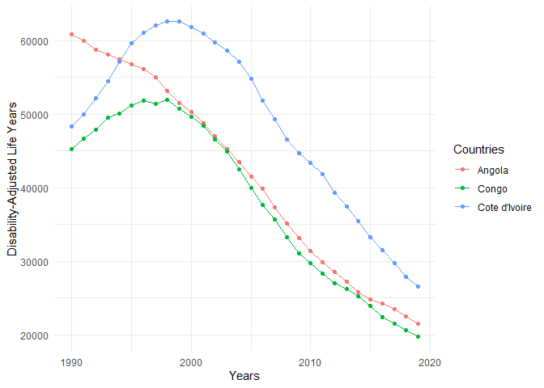
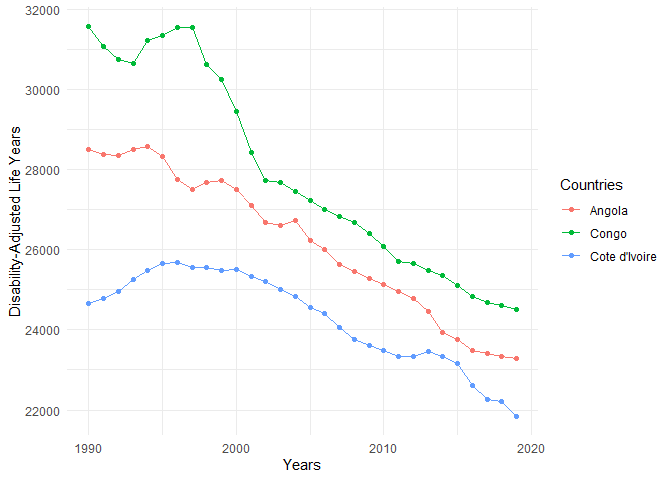

Global Disease Burden Analysis
================
Bruce Shinga WEMBULUA

# Introduction

This document compares the Disability-Adjusted Life Year (DALY) diseases
burden for three countries: COUNTRY 1, COUNTRY 2, and COUNTRY 3. We
compare the burden due to communicable, maternal, neonatal, and
nutritional diseases (CMNN), non-communicable diseases (NCDs), and
overall disease burden for these countries.

The source data is from the Institute for Health Metrics and Evaluation
(IHME) Global Burden of Disease (GBD) study.

# Communicable, Maternal, Neonatal, and Nutritional Disease Burden (CMNN)

    ## Rows: 8100 Columns: 4
    ## ── Column specification ────────────────────────────────────────────────────────
    ## Delimiter: ","
    ## chr (2): Entity, Code
    ## dbl (2): Year, DALYs (Disability-Adjusted Life Years) - Communicable, matern...
    ## 
    ## ℹ Use `spec()` to retrieve the full column specification for this data.
    ## ℹ Specify the column types or set `show_col_types = FALSE` to quiet this message.

## Table of Estimates for CMNN Burden Over Time

| year |   Angola |    Congo | Cote d’Ivoire |
|-----:|---------:|---------:|--------------:|
| 1990 | 60834.03 | 45241.61 |      48290.89 |
| 1991 | 59947.46 | 46678.41 |      49981.16 |
| 1992 | 58790.54 | 47933.88 |      52152.32 |
| 1993 | 58131.63 | 49504.96 |      54533.43 |
| 1994 | 57449.72 | 50076.84 |      57163.73 |
| 1995 | 56765.55 | 51190.09 |      59688.74 |
| 1996 | 56124.06 | 51827.38 |      61083.07 |
| 1997 | 55033.19 | 51404.94 |      62032.09 |
| 1998 | 53145.02 | 51972.44 |      62582.06 |
| 1999 | 51554.03 | 50793.18 |      62606.74 |
| 2000 | 50329.27 | 49648.12 |      61840.78 |
| 2001 | 48792.86 | 48462.64 |      60987.21 |
| 2002 | 46979.30 | 46608.69 |      59777.70 |
| 2003 | 45261.28 | 44914.69 |      58680.03 |
| 2004 | 43447.86 | 42537.84 |      57147.28 |
| 2005 | 41554.97 | 39942.80 |      54836.45 |
| 2006 | 39911.41 | 37650.58 |      51846.98 |
| 2007 | 37318.36 | 35685.90 |      49337.74 |
| 2008 | 35110.98 | 33311.77 |      46603.42 |
| 2009 | 33209.46 | 31032.82 |      44674.68 |
| 2010 | 31372.28 | 29779.70 |      43434.15 |
| 2011 | 29892.18 | 28359.89 |      41820.51 |
| 2012 | 28580.45 | 27036.79 |      39364.23 |
| 2013 | 27260.90 | 26198.38 |      37397.74 |
| 2014 | 25792.09 | 25234.82 |      35456.04 |
| 2015 | 24752.86 | 23880.71 |      33218.91 |
| 2016 | 24262.38 | 22426.88 |      31500.47 |
| 2017 | 23424.51 | 21528.06 |      29771.69 |
| 2018 | 22531.07 | 20631.19 |      27849.46 |
| 2019 | 21500.33 | 19790.12 |      26606.75 |

## Plot Showing Trends in CMNN Burden Over Time

<!-- -->

## Summary of CMNN Burden Findings

Provide a brief analysis based on the data presented in the table and
chart. Highlight any significant findings or patterns. About 3
sentences.

- Overall, we observe a decrease in DALYs over time across all three
  countries.

- However, the trend in DALYs for Côte d’Ivoire is notably distinct from
  that of Angola and Congo.

- Angola and Congo exhibit a similar trend.

# Non-Communicable Disease Burden (NCD)

    ## Rows: 8010 Columns: 4
    ## ── Column specification ────────────────────────────────────────────────────────
    ## Delimiter: ","
    ## chr (2): Entity, Code
    ## dbl (2): Year, DALYs (Disability-Adjusted Life Years) - Non-communicable dis...
    ## 
    ## ℹ Use `spec()` to retrieve the full column specification for this data.
    ## ℹ Specify the column types or set `show_col_types = FALSE` to quiet this message.

## Table of Estimates for NCD Burden Over Time

## Plot Showing Trends in NCD Burden Over Time

<!-- -->

## Summary of NCD Burden Findings

Provide a brief analysis based on the data presented in the table and
chart. Highlight any significant findings or patterns. About 3
sentences.

- Overall, we observe a decrease in DALYs over time across all three
  countries, but notably in Congo and Angola, where DALYs were higher in
  the 1990s.

# Overall Disease Burden

    ## Rows: 8100 Columns: 4
    ## ── Column specification ────────────────────────────────────────────────────────
    ## Delimiter: ","
    ## chr (2): Entity, Code
    ## dbl (2): Year, DALYs (Disability-Adjusted Life Years) - All causes - Sex: Bo...
    ## 
    ## ℹ Use `spec()` to retrieve the full column specification for this data.
    ## ℹ Specify the column types or set `show_col_types = FALSE` to quiet this message.

## Table of Estimates for Overall Disease Burden Over Time

| year |    Angola |     Congo | Cote d’Ivoire |
|-----:|----------:|----------:|--------------:|
| 1990 |  98087.44 |  82440.58 |      77150.23 |
| 1991 |  95738.36 |  83433.31 |      78953.53 |
| 1992 |  95521.56 |  84067.01 |      81326.43 |
| 1993 | 100371.31 |  86612.80 |      84091.94 |
| 1994 |  95577.07 |  87281.30 |      87014.36 |
| 1995 |  92588.19 |  88172.89 |      89804.22 |
| 1996 |  90757.36 |  89081.51 |      91190.26 |
| 1997 |  90618.19 | 109730.51 |      92011.61 |
| 1998 |  94063.11 |  95924.54 |      92565.51 |
| 1999 |  89538.21 |  88955.46 |      92536.70 |
| 2000 |  86555.92 |  85910.10 |      91863.09 |
| 2001 |  84280.31 |  82435.74 |      90668.35 |
| 2002 |  80793.28 |  79968.86 |      89653.47 |
| 2003 |  78688.03 |  77931.38 |      88291.14 |
| 2004 |  77092.04 |  75204.81 |      86387.93 |
| 2005 |  74411.51 |  72317.66 |      83593.24 |
| 2006 |  72377.45 |  69627.11 |      80343.83 |
| 2007 |  69245.51 |  67458.39 |      77377.10 |
| 2008 |  66682.03 |  64817.79 |      74258.74 |
| 2009 |  64448.53 |  62302.35 |      72141.66 |
| 2010 |  62311.88 |  60506.03 |      70783.30 |
| 2011 |  60501.71 |  58464.16 |      69457.88 |
| 2012 |  58814.46 |  57514.18 |      66517.51 |
| 2013 |  56949.87 |  56034.31 |      64718.50 |
| 2014 |  54709.58 |  54803.51 |      62641.31 |
| 2015 |  53346.14 |  53085.92 |      60180.59 |
| 2016 |  52420.92 |  51346.02 |      57765.07 |
| 2017 |  51424.75 |  50184.46 |      55574.90 |
| 2018 |  50373.88 |  49206.01 |      53557.01 |
| 2019 |  49198.56 |  48173.76 |      51848.48 |

## Plot Showing Trends in Overall Disease Burden Over Time

## Summary of Overall Disease Burden Findings

Provide a brief analysis based on the data presented in the table and
chart. Highlight any significant findings or patterns. About 3
sentences.

- We observe an overall decrease in DALYs annually for all three
  countries, with significant fluctuations between 1990 and 2020 for
  Angola and Congo.

- The DALYs trend in Congo is notably different from that of Angola and
  Côte d’Ivoire.
